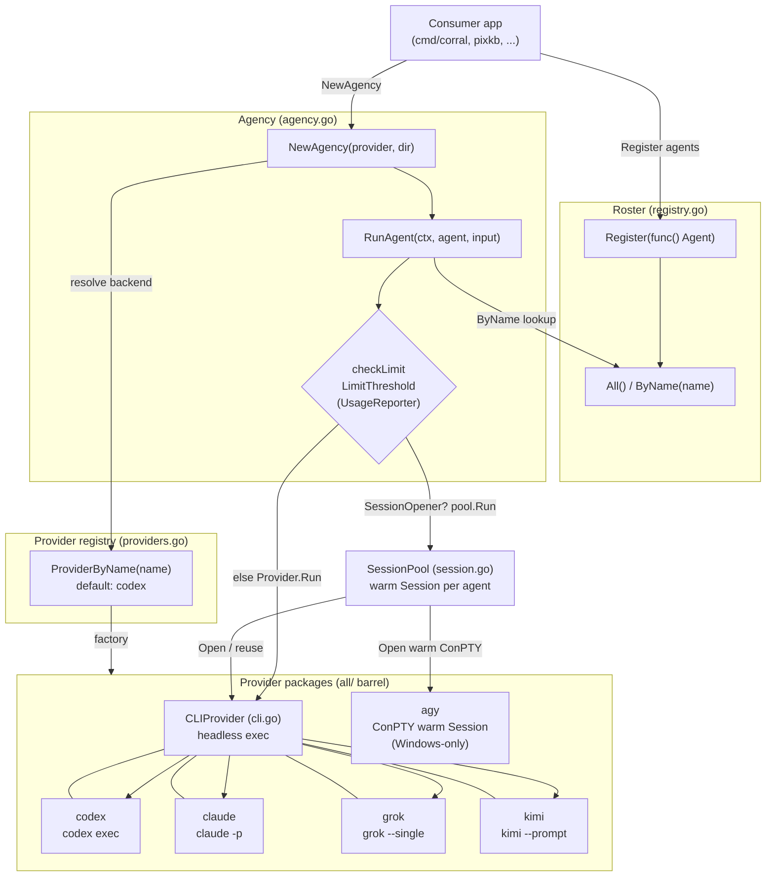
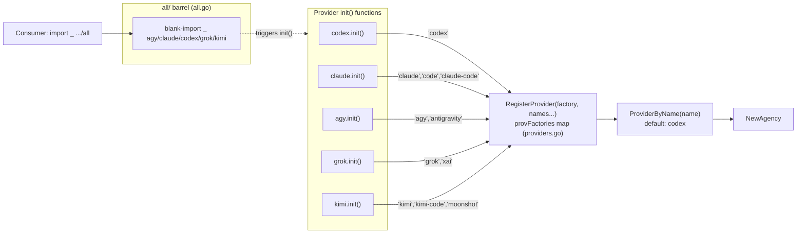

# Architecture

<!-- rev:002 -->

corral is a provider-abstracted runtime that drives subscription coding-agent
CLIs behind one `Provider` interface. The consumer supplies the agent roster
(`Register`/`All`/`ByName`) and picks a backend by name; the library owns the
machinery: a lazy provider registry, an `Agency` host, a warm `SessionPool`,
rate-limit awareness, and the shared `CLIProvider` exec harness. The three
diagrams below trace the real code paths in `provider.go`, `agency.go`,
`session.go`, `cli.go`, `providers.go`, and `registry.go`.

## System Overview

The consumer registers its agents into the roster and selects a `Provider` by
name. `NewAgency` resolves the provider from the registry (populated by the
`all/` barrel), pairs it with the roster, and — when the provider can open warm
sessions — wraps it in a `SessionPool`. Each turn flows through the rate-limit
gate into either a warm session or a one-shot `Run`, and finally to a backend:
the shared `CLIProvider` headless exec (codex, claude, grok, kimi) or the
agy ConPTY pseudo-console.



## Agent Turn

`Agency.RunAgent` first consults the rate-limit gate, then routes the turn
through the `SessionPool` (which reuses a warm `Session` or opens one) or, when
the provider cannot open sessions, calls `Provider.Run` directly. For a
`CLIProvider` backend, `Run` composes the prompt — embedding the JSON Schema
only when the CLI has no native schema flag — execs the binary (prompt passed
via `PromptFlag`, a trailing positional, or stdin when oversized), then reads
the result from stdout or the `--output` file into a `RunResult`.

```mermaid
sequenceDiagram
    autonumber
    participant C as Consumer
    participant A as Agency
    participant M as checkLimit (monitor.go)
    participant P as SessionPool
    participant S as Session
    participant V as CLIProvider
    participant X as Coding-agent CLI

    C->>A: RunAgent(ctx, agent, input)
    A->>M: checkLimit(provider, LimitThreshold)
    alt used% >= threshold
        M-->>A: ErrRateLimited
        A-->>C: RunResult{}, ErrRateLimited
    else within budget
        M-->>A: ok
        A->>A: build RunRequest{Agent, Input, Dir, Schema}
        alt pool present (SessionOpener)
            A->>P: Run(ctx, req)
            P->>P: get(agent) — reuse if Alive, else Open
            P->>S: Send(ctx, req)
        else no pool
            A->>V: Run(ctx, req)
        end
        S->>V: Send delegates to Run (one-shot) / warm turn
        V->>V: EffectiveSchema() + ComposePrompt(embed unless native)
        V->>V: argv(schemaPath, outPath, prompt)
        alt len(prompt) > maxArgPrompt (8000)
            V->>X: exec, prompt via stdin
        else
            V->>X: exec, prompt via PromptFlag/positional; stdin=/dev/null
        end
        X-->>V: stdout (or --output file)
        alt native schema + OutputFlag
            V->>V: read outPath JSON
        else
            V->>V: TrimSpace(stdout)
        end
        V-->>A: RunResult{Text, Provider}
        A-->>C: RunResult
    end
    Note over P,S: on Send error, pool.drop reopens next turn
```

## Provider Registration

The core package never imports the vendor packages. Each provider's `init()`
calls `RegisterProvider(factory, names...)` to store a lazy factory under its
canonical name and aliases. The `all/` barrel blank-imports every provider so
those `init()` functions fire, populating the registry before `ProviderByName`
is ever called. Importing `all` (or an individual provider) is what makes a
backend resolvable.


